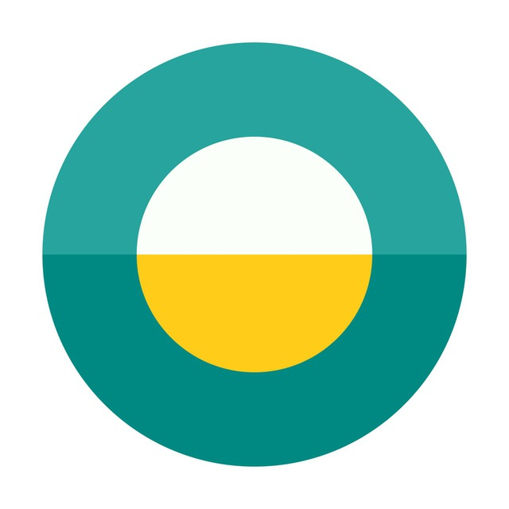
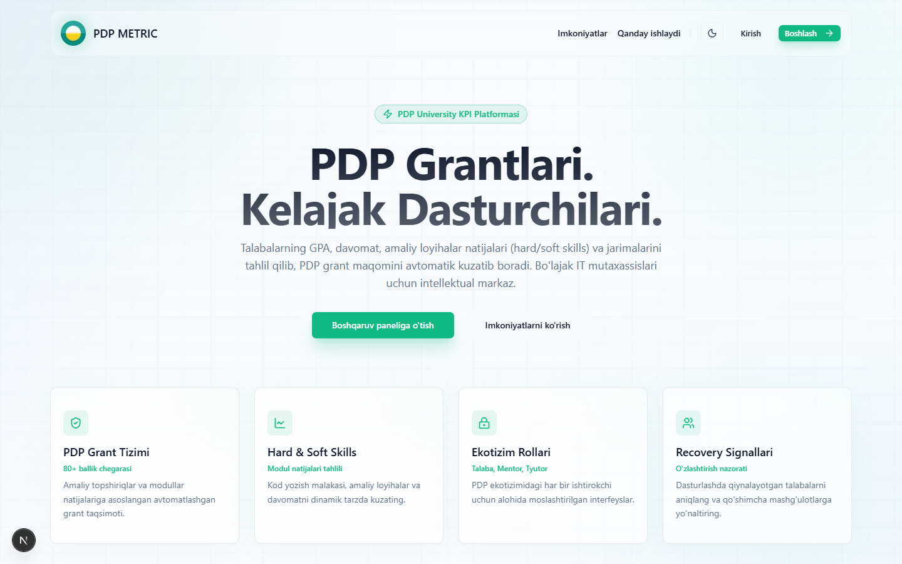
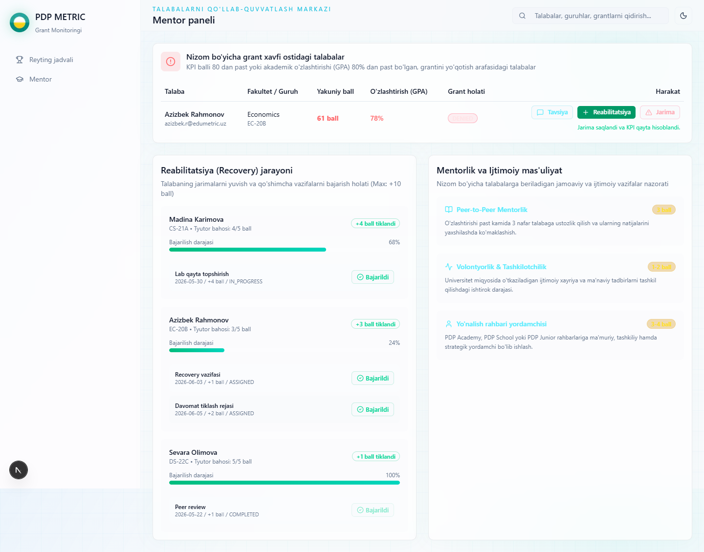
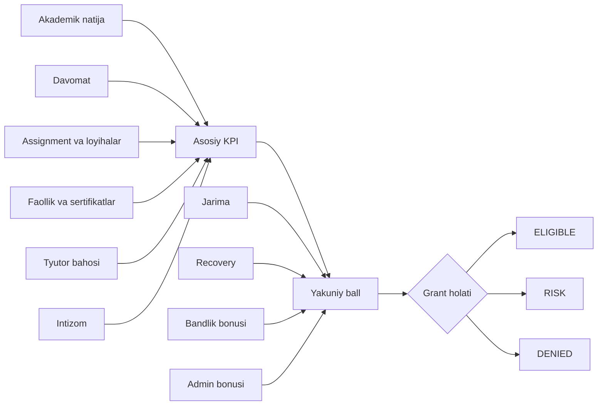
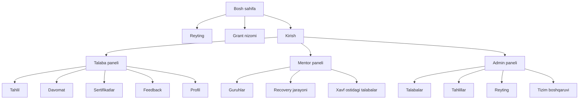
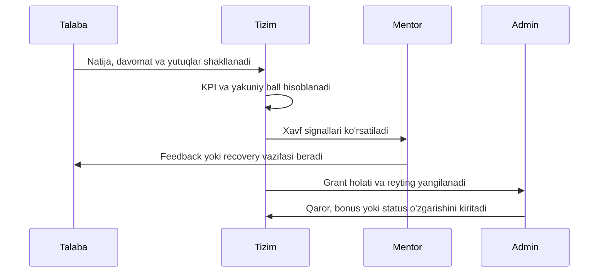
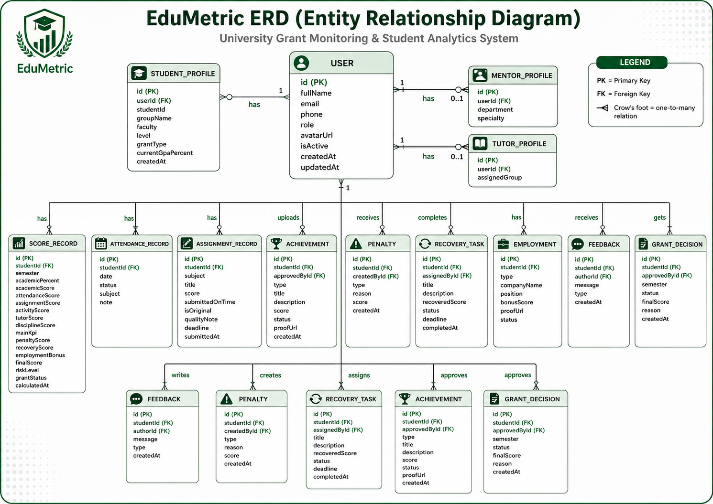

  

  <h1>PDP METRIC</h1>

  

    <b>Grant monitoringi, KPI reytingi, mentor nazorati va talaba rivojlanishini yagona raqamli markazda birlashtiruvchi platforma.</b>
  

  

   

  
  
  
  
  

 

  

## Loyiha Haqida

**PDP METRIC** - PDP University talabalari uchun grant holatini shaffof, tezkor va adolatli kuzatishga yordam beradigan zamonaviy web-platforma. Tizim talabaning akademik natijasi, davomat ko'rsatkichi, amaliy topshiriqlari, faolligi, intizomi, jarimalari va tiklanish vazifalarini bir joyda jamlaydi.

Platformaning asosiy g'oyasi oddiy: talaba o'z holatini aniq ko'radi, mentor va tyutor xavf signallarini vaqtida sezadi, admin esa grant qarorlarini dalillangan raqamlar asosida boshqaradi.

## Asosiy Imkoniyatlar

<table>
  <tr>
    <td width="50%">
      <h3>Talaba paneli</h3>
      
Shaxsiy KPI, grant holati, reyting o'rni, davomat grafigi, akademik trend, jarimalar tarixi, recovery jarayoni va yutuqlar ro'yxati bitta panelda ko'rinadi.

    </td>
    <td width="50%">
      <h3>Admin paneli</h3>
      
Talabalar ro'yxati, grant holatlari, yuqori xavf guruhi, umumiy tahlillar, reyting jadvali va tizim boshqaruvi uchun kengaytirilgan boshqaruv muhiti mavjud.

    </td>
  </tr>
  <tr>
    <td width="50%">
      <h3>Mentor va tyutor markazi</h3>
      
Biriktirilgan talabalar monitoringi, feedback berish, jarima kiritish, recovery vazifalarini belgilash va xavf ostidagi talabalarni kuzatish imkoniyati bor.

    </td>
    <td width="50%">
      <h3>Ochiq reyting</h3>
      
Talabalar yakuniy ballar asosida tartiblanadi. Reyting sahifasi umumiy ko'rinishda ishlaydi va ma'lumotlar maxfiyligi hisobga olinadi.

    </td>
  </tr>
</table>

## Nimalar Qila Oladi

| Yo'nalish | Imkoniyat |
| --- | --- |
| Grant monitoringi | Talabaning yakuniy ballini hisoblaydi va grant holatini `ELIGIBLE`, `RISK` yoki `DENIED` sifatida ajratadi. |
| Xavf tahlili | Natijaga qarab `LOW`, `MEDIUM`, `HIGH` xavf darajasini ko'rsatadi. |
| KPI hisoblash | Akademik natija, davomat, assignment, faollik, tyutor bahosi va intizom ballarini jamlaydi. |
| Jarima nazorati | Penalty ballarini hisobga oladi va yakuniy natijani avtomatik pasaytiradi. |
| Recovery jarayoni | Talabaga xatolarni tuzatish va ballni qisman tiklash imkonini beradi. |
| Achievement boshqaruvi | Sertifikat, musobaqa, loyiha, volontyorlik va boshqa yutuqlarni ko'rib chiqadi. |
| Feedback tizimi | Mentor, tyutor va admin tomonidan talaba faoliyati bo'yicha izoh va baho beriladi. |
| Bandlik bonusi | Internship, part-time, full-time yoki research assistant faoliyatlari uchun bonus ball qo'shiladi. |
| Grafik tahlillar | Recharts orqali davomat, akademik rivojlanish va grant taqsimoti vizual ko'rinadi. |
| Rollarga mos kirish | Student, Mentor, Tutor va Admin uchun alohida tajriba va ruxsatlar ishlaydi. |

## Vizual Tajriba

PDP METRIC faqat jadval va raqamlardan iborat emas. Interfeys foydalanuvchini charchatmaydigan, ammo muhim signallarni tez ko'rsatadigan tarzda qurilgan.

  
  

| Element | Tavsif |
| --- | --- |
| Animatsion panellar | `framer-motion` orqali sahifalar yumshoq harakat bilan ochiladi. |
| Glass-panel uslubi | Dashboard kartalari shaffof, yengil va zamonaviy ko'rinishda. |
| Dark va light mavzu | Foydalanuvchi o'ziga qulay rang rejimini tanlay oladi. |
| Status badge'lar | Grant, xavf va talaba holatlari tez ajralib turadi. |
| Responsiv dizayn | Talaba, mentor va admin panellari turli ekranlarda moslashadi. |
| Ikonkali navigatsiya | `lucide-react` ikonkalari orqali bo'limlar tez taniladi. |

## KPI Hisoblash Mantiqi

### Ball Formulasi

| Hisoblash | Formula |
| --- | --- |
| Asosiy KPI | `academic + attendance + assignment + activity + tutor + discipline` |
| Yakuniy ball | `mainKpi - penalty + recovery + employmentBonus + adminBonus` |
| Grantga munosib | Yakuniy ball `80` va undan yuqori bo'lsa |
| Grant xavfi | Yakuniy ball `80` dan past bo'lsa |
| Avtomatik rad etish | Akademik ko'rsatkich `80%` dan past bo'lsa |

## Rollar

| Rol | Nima Qiladi |
| --- | --- |
| `STUDENT` | Shaxsiy dashboard, KPI, grant holati, davomat, sertifikatlar, feedback va reytingni ko'radi. |
| `MENTOR` | Biriktirilgan talabalarni kuzatadi, feedback beradi, recovery vazifalarini belgilaydi. |
| `TUTOR` | Talabaning ijtimoiy faolligi, intizomi va kundalik jarayonlarini baholashda qatnashadi. |
| `ADMIN` | Barcha grant holatlari, reytinglar, talabalar, guruhlar va tizim boshqaruvini nazorat qiladi. |

## Sahifalar Xaritasi

| Sahifa | Mazmuni |
| --- | --- |
| `/` | Platformaning asosiy kirish sahifasi va grant monitoringi haqida qisqa tanishtiruv. |
| `/rating` | Talabalarning umumiy reyting jadvali. |
| `/rating/criteria` | Grant nizomi, KPI matrix, jarima, recovery va bonus qoidalari. |
| `/dashboard/student` | Talabaning shaxsiy grant monitoringi. |
| `/dashboard/student/analytics` | Akademik va davomat bo'yicha batafsil tahlil. |
| `/dashboard/student/attendance` | Davomat holati va qatnashuv tarixi. |
| `/dashboard/student/certificates` | Sertifikatlar va yutuqlar bilan ishlash. |
| `/dashboard/student/feedback` | Mentor yoki tyutor feedbacklari. |
| `/dashboard/mentor` | Mentor va tyutor uchun talabalarni qo'llab-quvvatlash markazi. |
| `/dashboard/admin` | Admin uchun grant, reyting, analitika va tizim boshqaruvi. |

## Grant Holati Oqimi

## Ma'lumotlar Tuzilmasi

Platforma talaba hayotidagi asosiy jarayonlarni alohida model sifatida saqlaydi: foydalanuvchi profili, akademik ballar, davomat, topshiriqlar, yutuqlar, jarimalar, recovery vazifalari, bandlik, feedback va grant qarorlari.

  

## Texnologik Asos

| Qism | Texnologiya |
| --- | --- |
| Frontend | Next.js App Router, React, TypeScript |
| UI tizimi | Tailwind CSS, shadcn uslubidagi komponentlar, Base UI |
| Animatsiya | Framer Motion, `tw-animate-css` |
| Grafiklar | Recharts |
| Ikonkalar | Lucide React |
| Autentifikatsiya | NextAuth, Prisma Adapter, bcryptjs |
| Ma'lumotlar bazasi | PostgreSQL |
| ORM | Prisma |
| Tema | next-themes |
| Sifat nazorati | ESLint, TypeScript |

## Xavfsizlik Va Maxfiylik

| Himoya | Qanday Ishlaydi |
| --- | --- |
| Rollarga asoslangan ruxsat | Har bir sahifa va amal foydalanuvchi roliga qarab cheklanadi. |
| Server session | Foydalanuvchi holati server tomonda tekshiriladi. |
| Parol xavfsizligi | Parollar hash ko'rinishida saqlanadi. |
| Talaba ma'lumotlari | Ochiq sahifalarda sezgir ma'lumotlar cheklangan ko'rinishda beriladi. |
| Admin amallari | Grant qarorlari va ball o'zgarishlari alohida nazorat qilinadi. |
| Mentor chegarasi | Mentor va tyutor faqat o'ziga biriktirilgan talabalar bilan ishlaydi. |

## Dashboardlar Kesimi

  
<b>Talaba paneli</b>

  Talaba o'z yakuniy balli, asosiy KPI, davomat foizi, akademik natijasi, reytingdagi o'rni, grant holati va xavf darajasini ko'radi. Panelda jarimalar tarixi, recovery progress, shaxsiy tavsiyalar va yutuqlar ham mavjud.

  
<b>Mentor va tyutor paneli</b>

  Mentor yoki tyutor talabalar ro'yxatini ko'radi, xavf ostidagi talabalarni ajratadi, feedback beradi, jarima kiritadi, recovery vazifasini tayinlaydi va talabaning tiklanish jarayonini kuzatadi.

  
<b>Admin paneli</b>

  Admin barcha talabalar, grant holatlari, reyting jadvali, grant taqsimoti, yuqori xavf guruhi va tizim boshqaruvi bo'limlari bilan ishlaydi. Talaba statusini o'zgartirish, yutuqlarni tasdiqlash va qarorlar tarixini yuritish mumkin.

  
<b>Ochiq reyting va grant nizomi</b>

  Reyting sahifasi talabalarning yakuniy ballarini ko'rsatadi. Grant nizomi sahifasida esa KPI matrix, akademik talablar, jarimalar, recovery, bandlik bonusi va grantni saqlab qolish mezonlari batafsil yoritilgan.

## Loyiha Kuchli Tomonlari

| Kuchli Jihat | Natija |
| --- | --- |
| Shaffof ball tizimi | Har bir ball nimadan kelgani ko'rinadi. |
| Erta ogohlantirish | Grant xavfi vaqtida seziladi. |
| Mentorlik jarayoni | Talaba faqat baholanmaydi, balki tiklanish yo'liga yo'naltiriladi. |
| Real vaqtga yaqin dashboard | Admin va mentorlar joriy holatni tez ko'radi. |
| Ma'lumotga asoslangan qaror | Grant qarorlari subyektivlikdan ko'ra aniq ko'rsatkichlarga tayanadi. |
| Vizual tahlil | Raqamlar grafik, status va badge'lar orqali oson o'qiladi. |

## Platforma Ruhi

> PDP METRIC talabaning faqat bugungi ballini emas, uning o'sish yo'lini ham ko'rsatadi. Platforma grantni nazorat qilish bilan birga, talabani qo'llab-quvvatlash, xatodan keyin tiklanish va kuchli natijaga qaytish madaniyatini shakllantiradi.

  

